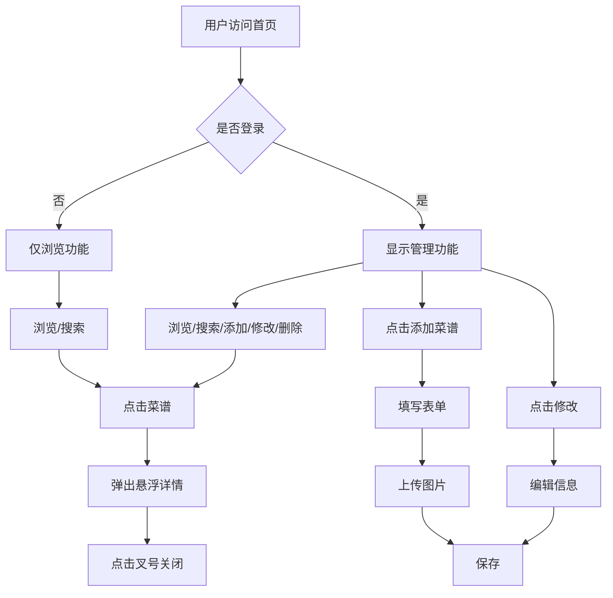

## 1. Product Overview
智能菜谱网站，提供菜谱浏览、搜索、分类查看功能，支持AI辅助获取菜谱数据。登录用户可添加和修改菜谱，未登录用户仅可查看。适配手机和电脑端，支持微信打开链接。

## 2. Core Features

### 2.1 User Roles
| Role | Registration Method | Core Permissions |
|------|---------------------|------------------|
| Admin | 固定账号登录 | 浏览、搜索、添加、修改、删除菜谱 |
| Guest | 无需注册 | 浏览、搜索菜谱 |

### 2.2 Feature Module
1. **首页**: 菜谱列表、分类侧边栏、搜索框、登录入口
2. **菜谱详情**: 悬浮弹窗展示配料、步骤、时间等信息
3. **登录页**: 账号密码登录
4. **菜谱编辑**: 添加/修改菜谱表单

### 2.3 Page Details
| Page Name | Module Name | Feature description |
|-----------|-------------|---------------------|
| 首页 | 侧边栏分类 | 左侧展示菜类分类，点击筛选菜谱列表 |
| 首页 | 搜索框 | 顶部搜索框，支持模糊搜索菜谱名称和配料 |
| 首页 | 菜谱列表 | 卡片式展示菜谱，显示图片和基本信息 |
| 首页 | 登录入口 | 右上角登录按钮，登录后显示管理入口 |
| 菜谱详情 | 悬浮弹窗 | 点击菜谱卡片弹出详情，仅点击叉号关闭 |
| 菜谱详情 | 配料展示 | 清晰列出配料及用量 |
| 菜谱详情 | 步骤展示 | 按顺序展示烹饪步骤，行间距适中 |
| 菜谱详情 | 时间信息 | 显示准备时间和烹饪时间 |
| 登录页 | 登录表单 | 账号密码输入，固定账号验证 |
| 菜谱编辑 | 添加表单 | 上传图片、填写名称、分类、配料、步骤等 |
| 菜谱编辑 | 修改表单 | 编辑已有菜谱信息 |

## 3. Core Process

### 3.1 浏览流程
用户访问首页 → 查看侧边栏分类 → 点击分类筛选菜谱 → 点击菜谱卡片 → 弹出悬浮详情 → 点击叉号关闭

### 3.2 搜索流程
用户输入关键词 → 实时模糊匹配 → 展示匹配菜谱列表

### 3.3 登录流程
点击登录 → 输入账号密码 → 验证通过 → 显示管理功能

### 3.4 添加菜谱流程
登录后点击添加 → 填写菜谱信息 → 上传图片 → 提交保存

### 3.5 修改菜谱流程
登录后点击菜谱 → 点击编辑 → 修改信息 → 保存更新

### 3.6 Mermaid Flowchart

## 4. User Interface Design

### 4.1 Design Style
- **主色调**: 简约白色背景，浅绿色(#90EE90)作为交互色
- **按钮风格**: 圆角矩形，悬停时浅绿色高亮
- **字体**: 略大字体，主标题18px，正文16px，步骤文字15px
- **行间距**: 1.8倍行间距，避免紧凑堆叠
- **布局**: 卡片式布局，左侧分类侧边栏，右侧菜谱列表
- **图标**: 简洁线条图标

### 4.2 Page Design Overview
| Page Name | Module Name | UI Elements |
|-----------|-------------|-------------|
| 首页 | 侧边栏 | 固定左侧，分类列表，选中项浅绿色高亮 |
| 首页 | 搜索框 | 顶部居中，圆角输入框，搜索图标 |
| 首页 | 菜谱卡片 | 图片+名称+时间，悬停放大效果 |
| 首页 | 登录按钮 | 右上角，圆角按钮 |
| 详情弹窗 | 关闭按钮 | 右上角叉号，点击关闭 |
| 详情弹窗 | 内容区 | 大图+标题+时间+配料+步骤 |
| 编辑表单 | 表单元素 | 输入框、文本域、文件上传、分类选择 |

### 4.3 Responsiveness
- **桌面端**: 左侧分类侧边栏固定，右侧菜谱列表网格布局
- **移动端**: 顶部分类标签栏，菜谱列表单列布局
- **微信适配**: 确保页面在微信内置浏览器正常显示
- **触摸优化**: 按钮尺寸适合手指点击

## 5. Data Management

### 5.1 Data Model
| Field | Type | Description |
|-------|------|-------------|
| id | string | 菜谱唯一标识 |
| name | string | 菜谱名称 |
| category | string | 菜类分类 |
| image | string | 图片URL |
| ingredients | string[] | 配料列表 |
| steps | string[] | 步骤列表 |
| prep_time | number | 准备时间(分钟) |
| cook_time | number | 烹饪时间(分钟) |
| created_at | timestamp | 创建时间 |
| updated_at | timestamp | 更新时间 |

### 5.2 Data Storage
- 使用Supabase存储菜谱数据
- 图片存储在Supabase Storage
- 支持实时更新和快速渲染

## 6. AI Integration
- 提供AI辅助生成菜谱功能
- 用户输入菜谱名称，AI返回配料和步骤建议
- 用户可编辑后保存