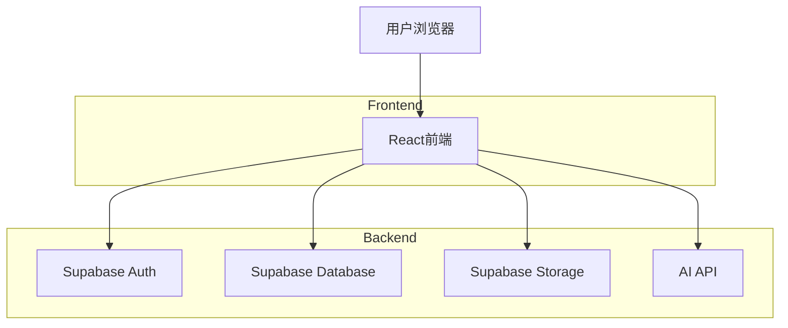
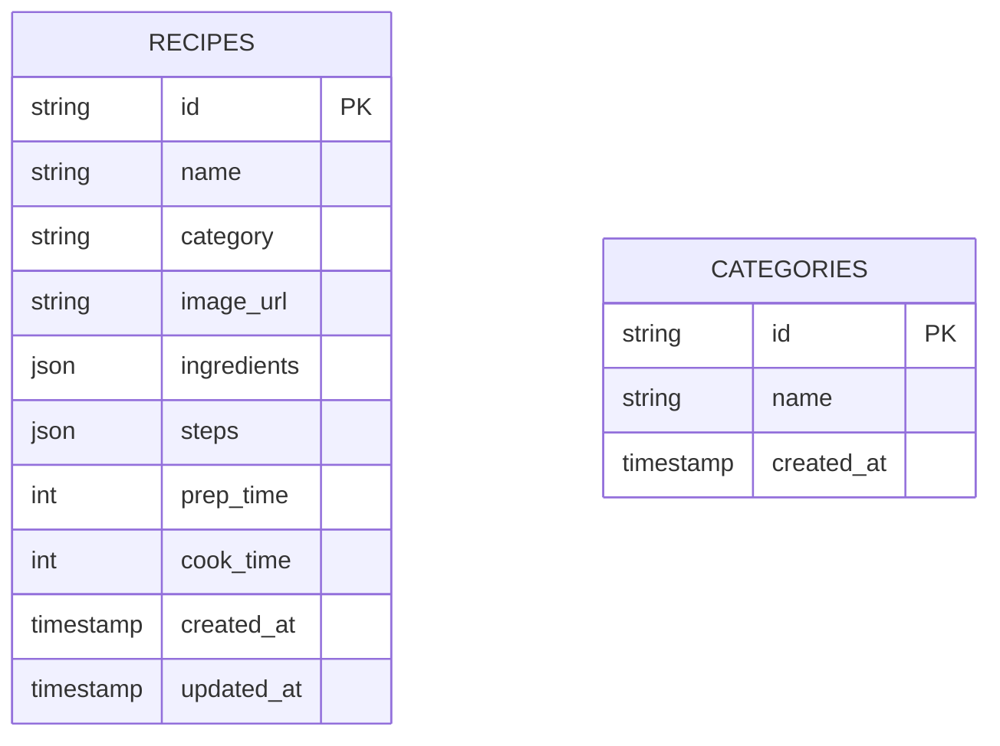

## 1. Architecture Design



## 2. Technology Description
- Frontend: React@18 + TailwindCSS@3 + Vite
- Initialization Tool: vite-init
- Backend: Supabase
- Database: Supabase (PostgreSQL)
- Storage: Supabase Storage

## 3. Route Definitions
| Route | Purpose |
|-------|---------|
| / | 首页，展示菜谱列表和分类 |
| /login | 登录页面 |

## 4. API Definitions

### 4.1 Auth API
| Method | Endpoint | Description |
|--------|----------|-------------|
| POST | /api/login | 用户登录 |
| POST | /api/logout | 用户登出 |

### 4.2 Recipe API
| Method | Endpoint | Description |
|--------|----------|-------------|
| GET | /api/recipes | 获取菜谱列表 |
| GET | /api/recipes/:id | 获取单个菜谱 |
| POST | /api/recipes | 添加新菜谱 |
| PUT | /api/recipes/:id | 更新菜谱 |
| DELETE | /api/recipes/:id | 删除菜谱 |
| GET | /api/categories | 获取分类列表 |

### 4.3 AI API
| Method | Endpoint | Description |
|--------|----------|-------------|
| POST | /api/ai/generate | AI生成菜谱建议 |

## 5. Data Model

### 5.1 Data Model Definition


### 5.2 Data Definition Language

```sql
CREATE TABLE categories (
    id UUID PRIMARY KEY DEFAULT gen_random_uuid(),
    name VARCHAR(50) NOT NULL,
    created_at TIMESTAMP DEFAULT CURRENT_TIMESTAMP
);

INSERT INTO categories (name) VALUES 
('家常菜'),
('川菜'),
('粤菜'),
('湘菜'),
('甜品'),
('汤羹'),
('主食'),
('其他');

CREATE TABLE recipes (
    id UUID PRIMARY KEY DEFAULT gen_random_uuid(),
    name VARCHAR(100) NOT NULL,
    category VARCHAR(50) NOT NULL,
    image_url VARCHAR(500),
    ingredients JSONB NOT NULL,
    steps JSONB NOT NULL,
    prep_time INT DEFAULT 0,
    cook_time INT DEFAULT 0,
    created_at TIMESTAMP DEFAULT CURRENT_TIMESTAMP,
    updated_at TIMESTAMP DEFAULT CURRENT_TIMESTAMP
);

CREATE INDEX idx_recipes_category ON recipes(category);
CREATE INDEX idx_recipes_name ON recipes(name);
```

## 6. Project Structure

```
智能菜谱app/
├── src/
│   ├── components/
│   │   ├── Sidebar.tsx          # 侧边栏分类组件
│   │   ├── SearchBar.tsx        # 搜索框组件
│   │   ├── RecipeCard.tsx       # 菜谱卡片组件
│   │   ├── RecipeList.tsx       # 菜谱列表组件
│   │   ├── RecipeDetail.tsx     # 菜谱详情弹窗组件
│   │   ├── LoginModal.tsx       # 登录弹窗组件
│   │   ├── RecipeForm.tsx       # 菜谱编辑表单组件
│   │   └── Header.tsx           # 头部组件
│   ├── hooks/
│   │   ├── useAuth.ts           # 登录状态管理
│   │   └── useRecipes.ts        # 菜谱数据管理
│   ├── utils/
│   │   ├── supabase.ts          # Supabase配置
│   │   ├── storage.ts           # 存储工具
│   │   └── ai.ts                # AI接口
│   ├── types/
│   │   └── index.ts             # 类型定义
│   ├── App.tsx                  # 主应用组件
│   ├── main.tsx                 # 入口文件
│   └── index.css                # 全局样式
├── index.html
├── package.json
├── vite.config.ts
├── tailwind.config.js
├── postcss.config.js
└── tsconfig.json
```

## 7. Supabase Configuration

### 7.1 Auth Settings
- Disable email confirmation
- Allow email/password authentication
- Configure JWT expiration

### 7.2 Storage Settings
- Create bucket: `recipe-images`
- Public access enabled
- File size limit: 5MB

### 7.3 Row Level Security
```sql
-- Categories
ALTER TABLE categories ENABLE ROW LEVEL SECURITY;
CREATE POLICY "Allow read access to all users" ON categories 
    FOR SELECT USING (true);

-- Recipes
ALTER TABLE recipes ENABLE ROW LEVEL SECURITY;
CREATE POLICY "Allow read access to all users" ON recipes 
    FOR SELECT USING (true);
CREATE POLICY "Allow authenticated users to modify" ON recipes 
    FOR INSERT WITH CHECK (auth.role() = 'authenticated');
CREATE POLICY "Allow authenticated users to update" ON recipes 
    FOR UPDATE WITH CHECK (auth.role() = 'authenticated');
CREATE POLICY "Allow authenticated users to delete" ON recipes 
    FOR DELETE USING (auth.role() = 'authenticated');
```

## 8. Security Considerations
- 使用Supabase内置认证系统
- 固定管理员账号验证
- 图片上传限制大小和格式
- 输入内容安全过滤
- HTTPS加密传输